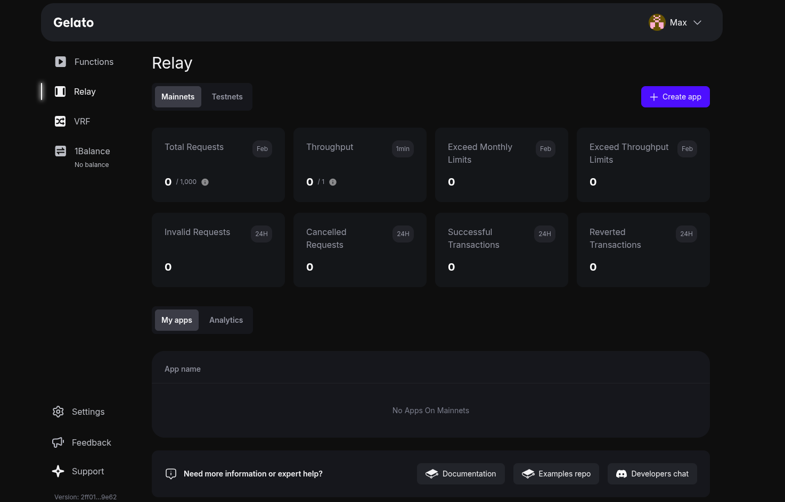
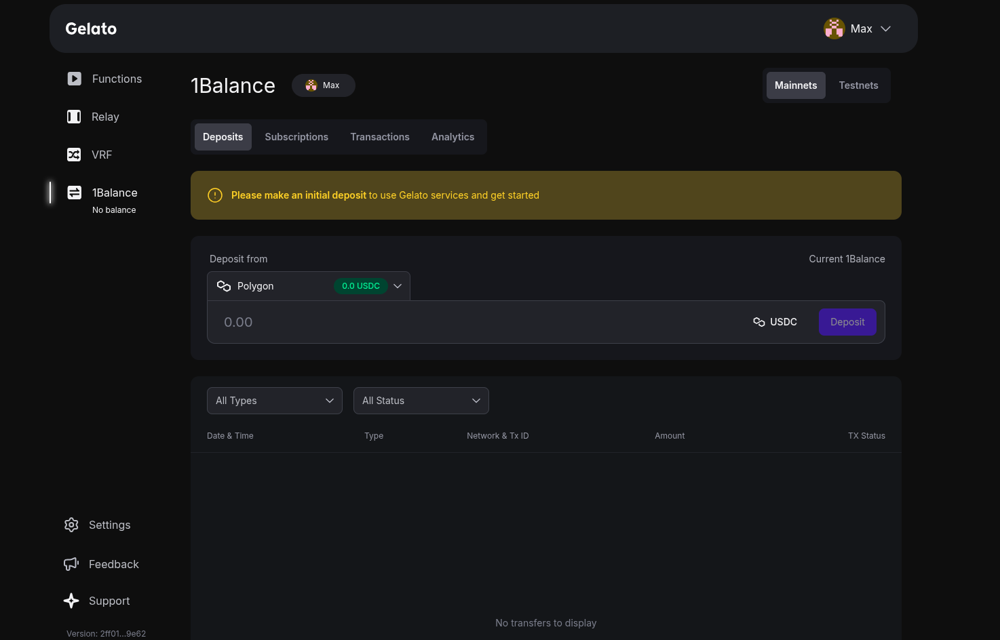

# Sponsored Calls

Sponsored Calls enable you to cover your users' gas fees, providing a seamless and gasless experience for interacting with your dApp. This is made possible through Gelato's multi-chain unified gas payment system, 1Balance. Learn more about 1Balance here.

## Initial Steps

### 1. Create Your Gelato Account
Sign up on the Gelato App to establish an account. This account is the foundation for setting up relay tasks and managing gas sponsorships.

### 2. Create a Relay App
Within your Gelato account, create a relay app on the specific network where you plan to sponsor transactions. This step enables sponsored transactions on your chosen chain. Checkout supported networks here.



### 3. Retrieve Your Sponsor API Key
After creating the relay app, navigate to its dashboard to locate your Sponsor API Key. This key links your Gelato setup with 1Balance for gas sponsorship.

Gelato Relay now supports API key rotation, allowing users to create and delete API keys. This helps prevent unauthorized usage in case an API key is exposed.

### 4. Deposit Funds into 1Balance
Add funds to your 1Balance account according to your target environment:

- Mainnets: Deposit USDC.
- Testnets: Deposit Sepolia ETH.

Since 1Balance is deployed on Polygon, you can deposit USDC in one step, and deposits from other networks are supported via Circle CCTP. Learn more.



## Implementation Steps

### 1. Import GelatoRelaySDK into your front-end .js project
Import SponsoredCallRequest for Non ERC2771 sponsored calls with GelatoRelay.

```javascript
import { GelatoRelay, SponsoredCallRequest } from "@gelatonetwork/relay-sdk";
const relay = new GelatoRelay();
```

or

If you're using the Viem library in your project, consider importing @gelatonetwork/relay-sdk-viem.

```javascript
import { GelatoRelay, SponsoredCallRequest } from "@gelatonetwork/relay-sdk-viem";
const relay = new GelatoRelay();
```

#### For ERC2771 Sponsored Calls (Recommended)
Import CallWithERC2771Request for ERC2771 sponsored calls with GelatoRelay. Learn more about ERC2771 here.

```javascript
import { GelatoRelay, CallWithERC2771Request } from "@gelatonetwork/relay-sdk-viem";
```

Once we have imported the GelatoRelay class, when using ERC2771 methods, we must initialize it with the appropriate trustedForwarder. 
The possible configurations are: 

```javascript
contract: {
    relay1BalanceERC2771: "trustedForwarder for method sponsoredCallERC2771",
    relayERC2771: "trustedForwarder for method callWithSyncFeeERC2771",
    relay1BalanceConcurrentERC2771: "trustedForwarder for method concurrent sponsoredCallERC2771",
    relayConcurrentERC2771:"trustedForwarder for method concurrent callWithSyncFeeERC2771",
    relay1BalanceConcurrentERC2771zkSync: "trustedForwarder for method concurrent sponsoredCallERC2771 on zkSync",
    relay1BalanceERC2771zkSync: "trustedForwarder for method sponsoredCallERC2771 on zkSync",
    relayConcurrentERC2771zkSync: "trustedForwarder for method concurrent callWithSyncFeeERC2771 on zkSync",
    relayERC2771zkSync: "trustedForwarder for method callWithSyncFeeERC2771 on zkSync",
}
```

We will need to go to the Supported Networks and check the network and the contract addresses to identify the trustedForwarder associated with our method.
In the example below, we are using the method sponsoredCallERC2771 on Sepolia, the trustedForwarder associated is 0xd8253782c45a12053594b9deB72d8e8aB2Fca54c. We will initialize GelatoRelay with the following config:

```javascript
const relay = new GelatoRelay({
    contract: {
        relay1BalanceERC2771:"0xd8253782c45a12053594b9deB72d8e8aB2Fca54c"
    }
});
```

### 2. Deploy a smart contract
For non-ERC2771 sponsored calls, no modifications are required in your target contract. Below is an example of a target contract.

```solidity
contract TargetContract {
    // your logic
    function example() external {
        // your logic
    }
}
```

#### For ERC2771 Sponsored Calls
Import ERC2771Context into your target contract and initialize it in the constructor with the appropriate trusted forwarder based on your use case. checkout list of trusted forwarders here.  

```solidity
import {
    ERC2771Context
} from "@gelatonetwork/relay-context/contracts/vendor/ERC2771Context.sol";

contract TargetContract is ERC2771Context {
    // ERC2771Context: setting the immutable trustedForwarder variable
    constructor(address trustedForwarder) ERC2771Context(trustedForwarder) {}
    function example() external{
        // your logic
    }
}
```

### 3. Generate a payload for your target contract

```javascript
// set up target address and function signature abi
const targetContractAddress = "your target contract address";
const abi = ["function example()"];

const [address] = await window.ethereum!.request({
      method: "eth_requestAccounts",
 });

// generate payload using front-end provider such as MetaMask
const client = createWalletClient({
      account: address,
      chain,
      transport: custom(window.ethereum!),
});
const chainId = await client.getChainId();

//encode function data
const data = encodeFunctionData({
    abi: abi,
    functionName: "example",
});
```

### 4. Send the payload to Gelato

```javascript
// Populate a relay request
const request: SponsoredCallRequest = {
  chainId: BigInt(chainId),
  target: targetContractAddress,
  data: data as BytesLike,
};
const relayResponse = await relay.sponsoredCall(
    request,
    GELATO_RELAY_API_KEY
);
```

#### For ERC2771 Sponsored Calls

```javascript
// Populate a relay request
const request : CallWithERC2771Request = {
    user: address,
    chainId: BigInt(chainId),
    target: targetContractAddress,
    data: data as BytesLike,
};

const response = await relay.sponsoredCallERC2771(
    request,
    client as any,
    GELATO_RELAY_API_KEY
);
```

Learn more about implementation of ERC2771 Sponsored Calls here and Non ERC2771 Sponsored Calls here.