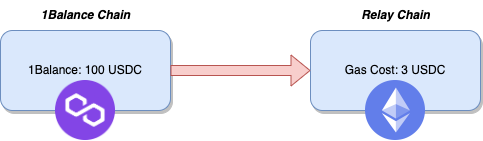

Please go to [https://app.gelato.network/1balance](https://app.gelato.network/1balance) and log in with your wallet. Deposit SEP for testnets via Sepolia, or USDC on Polygon for production networks and generate an API key based on your needs. Once you have your API key, you are ready to send sponsoredCall and sponsoredCallERC2771 requests.

> **Note:** You will have to generate two separate API keys if using both testnets and production i.e. one API key for testnets, one API key for production networks.

Gelato 1Balance is a new flexible and bespoke payment system built from the ground up exclusively for Gelato customers. Gelato 1Balance allows for customers to deposit on any chain they prefer, whilst using that balance to cover their relay costs regardless of target chain.

## How does 1Balance work?

For example, a user can top up their Gelato 1Balance using USDC on Polygon. This USDC balance will now be used to cover all gas costs and fees for any relay call, regardless of the underlying chain.

Therefore, a user could request relay calls on Ethereum mainnet, and Gelato will query their 1Balance to see if they possess enough equivalent USDC to cover the costs for this call. If the balance is sufficient, Gelato will go ahead and relay the message on-chain.

After the transaction is successful, Gelato can use the transaction receipts to charge you exactly the amount that the transaction costs plus a nominal fee. This makes Gelato 1Balance much more friendly on your wallet than payment based on a priori gas simulation which can be uncertain at best, and lead to consistent overcharging in the worst case.

## How can I use 1Balance?

Gelato 1Balance is live for both testing and production networks.

### Testing
You can deposit SEP on Sepolia to cover any transactions across all supported Testnets.

### Production
You can deposit USDC on Polygon to cover any transactions across all supported Mainnets.

### Getting Started

1. Go to [https://app.gelato.network/1balance](https://app.gelato.network/1balance) and log in with your wallet. Make sure to be connected to the Sepolia network for testing or Polygon for production networks.

> **Note:** You will have to generate two separate API keys if using both testnets and production i.e. one API key for testnets, one API key for production networks.

2. Deposit SEP/USDC using the 1Balance tab.

3. Create a Relay App, under the Relay tab:
   - Give your target contract address, or use the any contract address.
   - If your contract is not verified via Etherscan, paste in a manual ABI to specify which function you want to call using relay.

4. Once you have successfully created a relay app, you can go ahead and copy your API key, which will be valid across all testnets for sponsoredCall, and sponsoredCallERC2771.